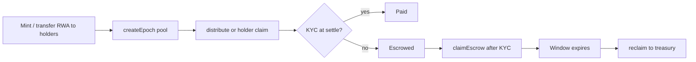

# Operations runbook

## Per-epoch workflow

### 1. Prepare holders

Ensure RWA balances reflect the record-date cap table. Transfers after `createEpoch` do not affect that epoch's snapshot.

### 2. Fund and create epoch (operator)

1. Approve dividend token to `DividendDistributor`
2. Call `createEpoch(totalPool)` — takes snapshot + pulls funds

### 3. Distribute (operator)

- Batch `distribute(epoch, recipients[])` in chunks (~100 addresses)
- Already-claimed addresses are skipped (no DoS from front-running `claim()`)
- Monitor `Paid`, `Escrowed`, `Skipped` events

### 4. Holder self-claim

Holders may call `claim(epoch)` if not yet settled.

### 5. Escrow resolution

- Ineligible holders: escrow until KYC, then `claimEscrow(epoch)` within the epoch's reclaim window
- After window: admin `reclaim(epoch, treasury)` sweeps remainder

## Admin controls

| Action | When |
|--------|------|
| `pause()` | Incident — stops distribute/claim/claimEscrow |
| `unpause()` | After incident cleared |
| `reclaim(epoch, to)` | After per-epoch window; blocked while paused |
| `setReclaimWindow(days)` | Policy change for **future** epochs only |
| `setKycRegistry(addr)` | Registry migration — **between epochs only** |
| `rescueToken(token, amount, to)` | Recover stray tokens; dividend token limited to unaccounted balance |

## KYC registry migration

The distributor's `kycRegistry` is admin-updatable to avoid stranding open epochs when Redbelly migrates registry contracts.

**Rules:**

1. Complete or reclaim all open epochs before switching, if possible
2. Call `setKycRegistry(newAddress)` during a quiet period
3. Escrow claims after migration use the **new** registry's `isAllowed()`
4. Document the change for auditors and holders

If you require immutability, redeploy the distributor and migrate epochs off-chain.

## Incident playbook

### Suspected exploit / abnormal transfers

1. `pause()` on `DividendDistributor` (and `RWAToken` if transfer hook enabled)
2. Assess `accountedDividendBalance` vs on-chain dividend token balance
3. Do **not** `rescueToken` on dividend token beyond stray excess
4. Coordinate with Redbelly on registry status

### Operator key compromise

1. Admin revokes `OPERATOR_ROLE` from compromised address
2. Grant role to new operator (multisig-controlled)
3. Rotate deploy/operator keys off-chain

### Stuck escrow

- Holder completes KYC → `claimEscrow`
- Window expired → `reclaim` to treasury, handle off-chain

## Monitoring

- `EpochCreated` — new epoch + snapshot id
- `Paid` / `Escrowed` / `Skipped` — settlement progress
- `Reclaimed` — epoch closed
- `KycRegistryUpdated` — registry migration

## Pre-mainnet checklist

- [ ] Multisig admin
- [ ] Real dividend token address (not mock)
- [ ] `npm test` + coverage ≥ 90%
- [ ] `npm run slither` triaged
- [ ] External audit (out of band)
- [ ] Contracts verified on explorer
